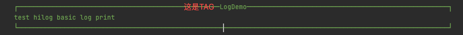
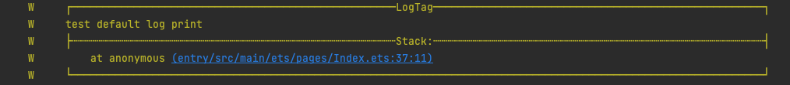
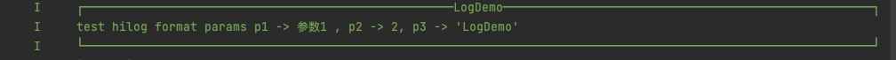
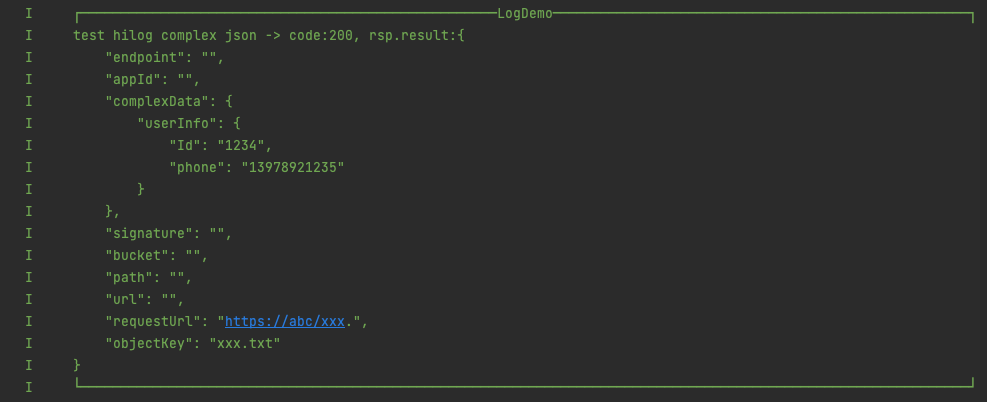
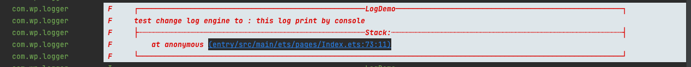

# <center>Logger</center>

-------------------------------------------------------------------------------
**[中文文档](README_CN.md)** ｜ **[Introduction](README.md)**

## Introduction

`Logger`is an lightweight HarmonyOS logging library that is simple, flexible, and ready to use out of the box.。

* **1.No initialization or additional configuration required**
* **2.Supports various log engines**
* **3.Supports log output formatting**
* **4.Supports printing logs and outputting the call stack at the same time, directly jumping to the code line on the console**
* **5.Supports automatic line breaks for overSized logs**
* **6.Quickly integrates other logging libraries, highly customizable**

-------------------------------------------------------------------------------

## Download and Installation
```shell
ohpm i @huolala/logger 
```
For more information regarding environment configuration for OpenHarmony ohpm, please refer to[How to install OpenHarmony ohpm package](https://gitee.com/openharmony-tpc/docs/blob/master/OpenHarmony_har_usage.md)
## Usage instruction
**1. Usage instruction**
 ```
   import {Logger} from "@huolala/logger"
   
   // optional
   import { LogEngine, LogStackType } from '@huolala/logger/src/main/com.wp/interfaces/ILog';
 ```

**2. User Guide**

* **2.1 Basic print log**

```
   Logger.v("LogDemo",`xxx`)
   
   ...i、d、w
   
   Logger.e("LogDemo",`xxx`)
```


* **2.2 Print log & log call entry stack**

```
    Logger.w("LogTag",`test default log print`, LogStackType.FIRST_STACK)
```


* **2.3 Print log & full log stack**

```
    Logger.e("LogDemo",`test hiloglog print with full stack`, LogStackType.FULL_STACK)
```


* **2.4 Print log & format parameters**

```
    Logger.i('LogDemo',`test console format params p1 -> %s , p2 -> %d, p3 -> %o`, 
            undefined, undefined, "参数1", 2 , 'LogDemo')
```


* **2.5 Print log & automatic formatting of json parameters**

```
    Logger.i('LogDemo',`test console complex json -> %s`, undefined, undefined, jsonLog)
```


* **2.6 Print overSized log (automatically wrap)**

```
    Logger.w('LogDemo',`test console long long log ${longlongLog}`)
```


* **2.7 Switch log engine per line**

```
     // (Does not affect the default log engine, only affects a single log)
     Logger.e('LogDemo',`test %s log print with params:%s`, 
        LogStackType._STACK, LogEngine.CONSOLE, 'this log print by console')
```


* **2.8 Set the maximum length of a single line of log**

```
    // Support (0-1024]
    Logger.setLogSingleLineMaxLength(100) 
```

* **2.9 Switch default log engine (Does not affect specific engines of a single log)**

```
    Logger.changeDefaultLogEngine(LogEngine.XXXX)
```

* **2.10 Change the default log stack output behavior (Does not affect the specified stack output scenarios for single logs)**

```
    /*
    * Default：LogStackType.NONE
    * LogStackType.FIRST_STACK : Print entry stack
    * LogStackType.FULL_STACK : Print complete stack
    */
    Logger.changeDefaultLogStackType(LogStackType.NONE)
```

* **2.11 Custom log printing ability**

```
    // 2.7.1 Set your log implementation
    Logger.setILog({
            log(logLevel: LogLevel, logTag: string, logMsg: string ,logEngine: LogEngine, logStackType: LogStackType) {
              // 完全自定义的日志打印逻辑
            }
          })
          
    // 2.7.2 Print log
    Logger.x()
```


