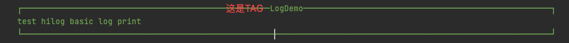
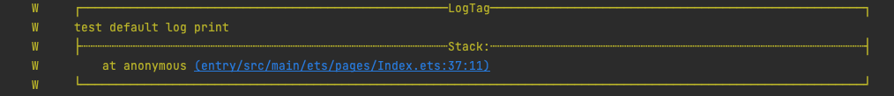
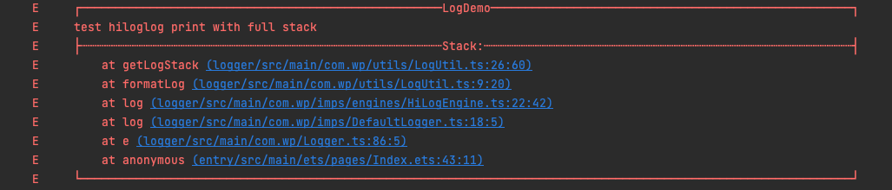
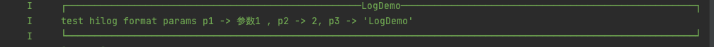
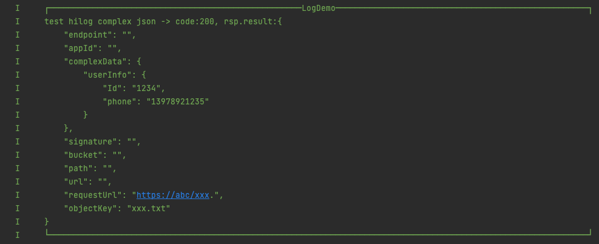
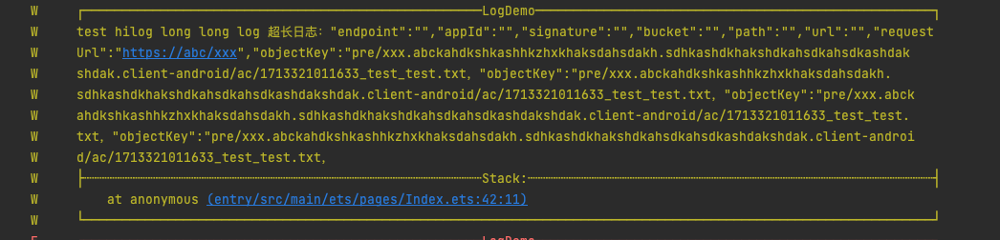
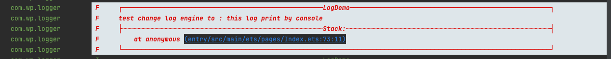

# <center>Logger</center>

-------------------------------------------------------------------------------
**[中文文档](README_CN.md)** ｜ **[Introduction](README.md)**

## 简介

`Logger`是一个超轻量级的鸿蒙日志库，简单、灵活， 开箱即用。

* **1.无需初始化，无需额外配置**
* **2.支持多种日志引擎**
* **3.支持日志格式化输出**
* **4.支持打印日志同时输出调用堆栈，控制台直接跳转代码行**
* **5.支持超长日志自动换行**
* **6.支持快速接入其他日志库，高度自定义**

-------------------------------------------------------------------------------

## 下载安装
```shell
ohpm i @huolala/logger 
```
OpenHarmony ohpm 环境配置等更多内容，请参考[如何安装 OpenHarmony ohpm 包](https://gitee.com/openharmony-tpc/docs/blob/master/OpenHarmony_har_usage.md)
## 使用说明
**1. 引入依赖**
 ```
   import {Logger} from "@huolala/logger"
   
   // optional
   import { LogEngine, LogStackType } from '@huolala/logger/src/main/com.wp/interfaces/ILog';
 ```

**2. 使用介绍**

* **2.1 基础打印日志**

```
   Logger.v("LogDemo",`xxx`)
   
   ...i、d、w
   
   Logger.e("LogDemo",`xxx`)
```


* **2.2 打印日志 & 日志调用入口堆栈**

```
    Logger.w("LogTag",`test default log print`, LogStackType.FIRST_STACK)
```


* **2.3 打印日志 & 日志完整堆栈**

```
    Logger.e("LogDemo",`test hiloglog print with full stack`, LogStackType.FULL_STACK)
```


* **2.4 打印日志，format参数**

```
    Logger.i('LogDemo',`test console format params p1 -> %s , p2 -> %d, p3 -> %o`, 
            undefined, undefined, "参数1", 2 , 'LogDemo')
```


* **2.5 打印日志，自动格式化json参数**

```
    Logger.i('LogDemo',`test console complex json -> %s`, undefined, undefined, jsonLog)
```


* **2.6 打印超长日志(自动换行)**

```
    Logger.w('LogDemo',`test console long long log ${longlongLog}`)
```


* **2.7 单条日志切换引擎**

```
     // （不影响默认日志引擎， 仅影响单条日志）
     Logger.e('LogDemo',`test %s log print with params:%s`, 
        LogStackType._STACK, LogEngine.CONSOLE, 'this log print by console')
```


* **2.8 设置单行日志最大长度**

```
    // 支持 0-1024 
    Logger.setLogSingleLineMaxLength(100) 
```

* **2.9 切换默认日志引擎 (不影响单条日志指定引擎)**

```
    Logger.changeDefaultLogEngine(LogEngine.XXXX)
```

* **2.10 切换默认日志堆栈输出行为(不影响单条日志指定堆栈输出场景)**

```
    /*
    * 默认：LogStackType.NONE
    * LogStackType.FIRST_STACK : 打印入口堆栈
    * LogStackType.FULL_STACK : 打印完整堆栈
    */
    Logger.changeDefaultLogStackType(LogStackType.NONE)
```

* **2.11 自定义日志打印能力**

```
    // 2.7.1 设置你的日志实现
    Logger.setILog({
            log(logLevel: LogLevel, logTag: string, logMsg: string ,logEngine: LogEngine, logStackType: LogStackType) {
              // 完全自定义的日志打印逻辑
            }
          })
          
    // 2.7.2 打印日志    
    Logger.x() 
```


